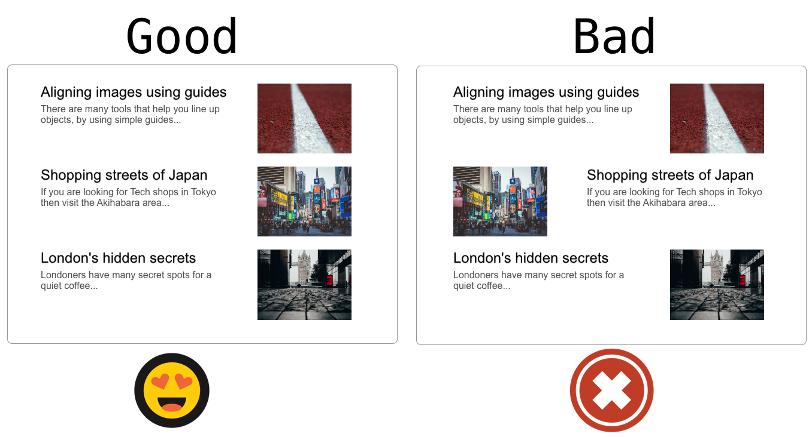

## Key principles ##
- **Keep articles with images aligned vertically.**
- If you have sections on a web page make sure that they are easy to scan by having the Images and Headings aligned vertically
- Do not alternate them from side to side. This makes the page hard to scan.
- Accessibility is improved by vertical alignment.

## Pattern
- Articles on a page have the images vertically aligned on one side.
- You can use either side as long as you stick to it.
- Align headings in a similar manner.  

## Anti Pattern
- Articles on a page that alternate between Images on Left and Right of page

## Supporting research
- This is a common pattern that is seen on many usability test rounds
- The California Page on the Scottish Enterprise website is an example (Doc Link to be added)

## Tags
- Easy to scan
- Layout
- Alignment
